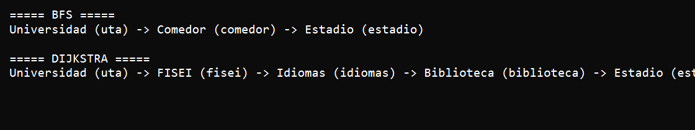

# APE 4 - Grafos: Mapa del Campus UTA


## Objetivo

Implementar un grafo mediante lista de adyacencia para representar rutas dentro del Campus Huachi de la UTA y comparar los resultados de los algoritmos BFS y Dijkstra.

## Actividad realizada

Se completo el archivo `APE4_Grafos.java`, resolviendo los metodos marcados como `TODO`:

- `agregarNodo()`
- `agregarArista()`
- `bfs()`
- `dijkstra()`

Tambien se agrego un archivo `.gitignore` para evitar subir archivos compilados de Java, como los `.class`.

## Estructura del proyecto

```text
Ape4-Grafos/
|
|-- APE4_Grafos.java
|-- README.md
|-- .gitignore
|-- captura/
    |-- captura1.png
```

## Implementacion

### Lista de adyacencia

El grafo usa dos estructuras principales:

- `Map<String, Nodo> nodos`: almacena los lugares del campus.
- `Map<String, List<Arista>> adyacencia`: almacena las conexiones entre nodos.

Cada arista contiene:

- `destino`: nodo conectado.
- `peso`: distancia entre los dos puntos.

### Metodo `agregarNodo()`

Este metodo registra un nuevo nodo en el mapa `nodos` y crea su lista de adyacencia vacia.

### Metodo `agregarArista()`

Este metodo agrega una arista no dirigida. Por eso, cada conexion se registra en ambos sentidos:

- origen a destino
- destino a origen

### Metodo `bfs()`

El algoritmo BFS busca la ruta con menor numero de paradas. Para lograrlo utiliza:

- una cola `Queue`
- un conjunto de visitados `Set`
- caminos parciales representados con listas

En este caso, BFS encuentra la ruta mas corta en cantidad de nodos intermedios.

### Metodo `dijkstra()`

El algoritmo Dijkstra busca la ruta con menor distancia total. Para lograrlo utiliza:

- un mapa de distancias minimas
- un mapa de nodos anteriores
- una cola de prioridad `PriorityQueue`

En este caso, Dijkstra considera el peso de cada arista para seleccionar la ruta de menor costo.

## Compilacion y ejecucion

### Compilar

```bash
javac APE4_Grafos.java
```

### Ejecutar

```bash
java APE4_Grafos
```

## Resultados obtenidos

### BFS

```text
===== BFS =====
Universidad (uta) -> Comedor (comedor) -> Estadio (estadio)
```

BFS selecciona esta ruta porque tiene menos paradas entre el inicio y el destino.

### Dijkstra

```text
===== DIJKSTRA =====
Universidad (uta) -> FISEI (fisei) -> Idiomas (idiomas) -> Biblioteca (biblioteca) -> Estadio (estadio)
```

Dijkstra selecciona esta ruta porque la distancia total es menor, aunque tenga mas paradas.

## Comparacion de algoritmos

| Algoritmo | Criterio | Ruta encontrada |
|---|---|---|
| BFS | Menor numero de paradas | Universidad -> Comedor -> Estadio |
| Dijkstra | Menor distancia total | Universidad -> FISEI -> Idiomas -> Biblioteca -> Estadio |

## Evidencia

Captura de la ejecucion en consola:



## Conclusion

La actividad permite comprobar que BFS y Dijkstra pueden entregar rutas diferentes dentro del mismo grafo. BFS optimiza la cantidad de paradas, mientras que Dijkstra optimiza la distancia total considerando los pesos de las aristas.

## Autor

Marlon Jeampierre Ortiz Torres - Tercero Software "B"


